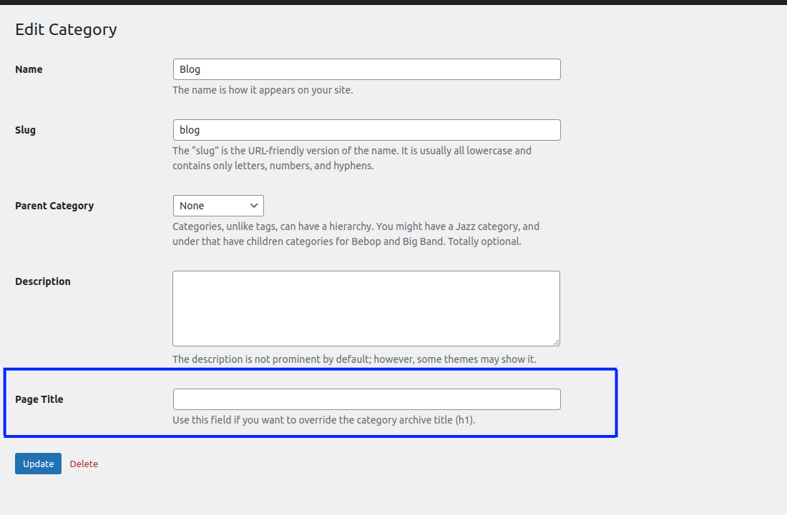

# WP Term Custom Heading

Override category archive page titles (h1) with custom text — like Genesis archive headlines, but for any theme.

## Description

This plugin adds a **Page Title** field to the WordPress category add/edit screens. When set, it replaces the default archive title on category pages.

Works with any theme that uses the `get_the_archive_title` filter (most modern themes do).

## Installation

1. Download the [latest release](https://github.com/mikezielonkadotcom/wp-category-customization/releases/latest).
2. In WordPress admin, go to **Plugins → Add New → Upload Plugin** and upload the ZIP.
3. Activate the plugin.

**Or** clone this repo into `wp-content/plugins/`:

```bash
cd wp-content/plugins
git clone https://github.com/mikezielonkadotcom/wp-category-customization.git
```

## Usage

1. Go to **Posts → Categories**.
2. Add or edit a category.
3. Enter your custom title in the **Page Title** field.
4. The category archive page will display your custom title instead of the default.



## Auto-Updates

This plugin checks GitHub for new releases automatically. When a new version is tagged, WordPress will show the update in the dashboard — no manual downloads needed.

## Requirements

- WordPress 5.5+
- PHP 7.4+

## FAQ

**Which themes are supported?**
Any theme that uses the `get_the_archive_title` hook to display category titles on archive pages.

**What taxonomies are supported?**
The default WordPress `category` taxonomy.

## Changelog

### 1.4.0
- Security: Add nonce verification and capability checks on save.
- Security: Fix XSS — escape output on edit form.
- Fix: Use `sanitize_text_field()` instead of `esc_attr()` for input sanitization.
- Fix: Register archive title override as filter instead of action.
- Update: Bump minimum WordPress requirement to 5.5.

### 1.3.1
- Test release workflow.

### 1.3.0
- Add automatic update checking from GitHub.
- Fix double `https://` in author and plugin URIs.

### 1.2
- Fix typo.

### 1.1
- Fixes and improvements.

### 1.0
- First release.

## License

GPL-2.0+ — see [LICENSE](https://www.gnu.org/licenses/gpl-2.0.txt).
